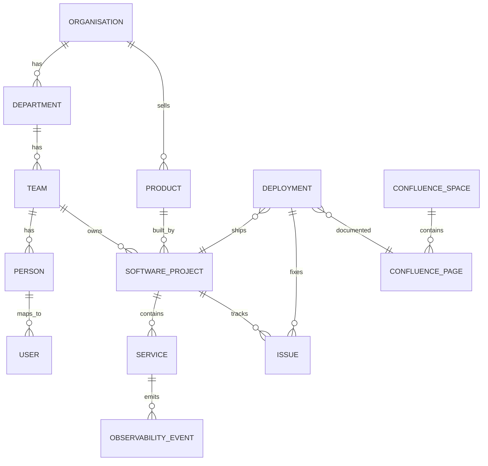

# mocks/data — canonical seed data for the mock API suite

This folder is the **single source of truth** for every fake entity the three mock servers
serve. The product-specific seeds (`mockapis/seed/*.json`,
`datadog/mock/seed/*.json`) should be **derived from this model** so the narrative is
consistent end-to-end: a Jira ticket references a Confluence page which references a Datadog
log, span, and deploy.

- `organisation.md` — the fake company: business, departments/teams, people, products, repos, environments.
- `components.md` — **component catalog**: every subcomponent, its owner/SME, dependencies, and the relationships component ↔ service ↔ team ↔ ticket ↔ page ↔ event ↔ deploy.
- `software-specs.md` — software specs per project: services, key flows, formats, incidents, deployments, observability expectations.
- `README.md` (this file) — the nature of the data: entity model, conventions, and how it maps to each product's store.

Actual seed artifacts (schema-shaped JSON that each product's store loads) will be generated
from these docs next — this documentation is the contract the generator (human or LLM)
must satisfy.

## 1. Nature of the data

- **One coherent fictional organisation** ("Brightline Robotics") with a business, staff,
  departments, software projects, and an operational track record (releases, incidents).
- **Schema-shaped**: every entity mirrors the DB model in `mockapis/DESIGN.md` — no legacy
  catalog shapes; seeds load directly into the store.
- **Cross-linked**: entities reference each other by stable ids/keys — ticket `ORB-1`,
  Confluence page `98302`, Datadog `service:orbiter-dashboard` log/span with
  `ticket: ORB-1`, deploy `git.commit.sha: 9f2c8a1`, `deployment: orbiter-prod-...`.
- **Stable identifiers + timestamps**: ISO-8601 UTC for all events; ids are unique and never
  reused (see `DESIGN.md`).
- **LLM-friendly**: an LLM given these docs + the repos can extend/regenerate seeds without
  re-deriving the fictional universe.

## 2. Entity model

Core entities:

| Entity | Kind | Canonical fields | Feeds which product store |
|---|---|---|---|
| Organisation | root | name, founded, business, markets | metadata (all) |
| Department | org unit | name, mission | — |
| Team | org unit | name, department, backlog prefix | — |
| Person / User | people | accountId, email, name, displayName, department, team, role, timeZone | `users` (Jira + Confluence) |
| Product | business | name, category, customers | — |
| Software project (repo) | code | key prefix, name, language, team, purpose | `projects` (Jira), `services` (Datadog) |
| Component | code | repo, service, owner (team), SME (person), dependencies, tickets, page | via `components.md` |
| Service | runtime | name, type, repo, envs | `apm-services`, `catalog-entities` (Datadog) |
| Issue / Ticket | work | key (`ORB-n`/`FLY-n`), type, status, priority, assignee, reporter, comments | `issues`, `comments`, `changelog` (Jira) |
| Confluence space | docs | key (`ENG`/`PD`), name | `spaces` (Confluence) |
| Confluence page | docs | id, type (page/blogpost), title, space, parent, bodyStorage, labels | `content` (Confluence) |
| Environment | runtime | dev/staging/prod | containers/process tags |
| Deployment / Release | runtime | pipeline, gitSha, gitTag, branch, status, date | `ci-pipelines` events (Datadog) |
| Host / Container / Process | infra | name, image, imageTags, tags | `containers`, `processes` (Datadog) |
| Log / Span / CI event | observability | kind, timestamp, service, host, tags, attributes, traceId… | `events.jsonl` (Datadog) |

## 3. Conventions

- **Identity**: people by accountId (`5d8a01bce4b0a0d01a6f1…`), Jira issues by `KEY-n`
  (project prefix + monotonic), Confluence pages by numeric id (`983xx`), spaces by short
  key, deployments by `git.commit.sha` + `deployment:<name>-<env>-<date>` tag,
  observability events by `service:<name>`, `env:<env>`, `ticket:<KEY-n>`.
- **Timestamps**: 2026, ISO-8601 UTC (e.g. `2026-09-10T08:00:00.000Z`).
- **Tags** (Datadog): `env:`, `service:`, `version:`, `git.commit.sha:`, `deployment:`,
  `team:`, `ticket:` — lowercase `k:v`.
- **Cross-links that MUST be consistent**: every issue about a service carries
  `service:<name>`; every related log/span carries `ticket: <issue key>`; every deploy of a
  repo carries the `git.commit.sha` that its services/containers report; every incident page
  names the ticket; every feature ticket documents where (Confluence page / service).

## 4. Relationship to per-product seeds

| Canonical entity | Product seed file | Notes |
|---|---|---|
| Person/User | `mockapis/seed/users.json` | schema-shaped `{id, name, email, displayName, active, timeZone, accountType}` |
| Software project | `mockapis/seed/projects.json` | used for Jira project + Datadog service/catalog |
| Issue/Ticket + comments | `mockapis/seed/issues.json`, `comments.json`, `changelog.json` | comments split out, stable ids |
| Space + Page | `mockapis/seed/spaces.json`, `content.json` | one `content` record → v1 + v2 projections |
| Service / catalog | `datadog/mock/seed/services.json`, `catalog-entities.json`, `catalog-relations.json` | dependency edges per service graph |
| Infra | `datadog/mock/seed/containers.json`, `processes.json` | tags carry version/git sha/deployment |
| Logs / Spans / CI | `datadog/mock/seed/events.jsonl` | single stream, `kind`=log/span/ci-pipeline/ci-job + facets |

## 5. Generation policy

Future seed generation must:
1. Stay consistent with `organisation.md` + `software-specs.md` (names, keys, services, tags).
2. Produce **schema-shaped** JSON/JSONL exactly matching the store collections listed above.
3. Keep every cross-link resolvable (ticket ↔ page ↔ service ↔ event ↔ deploy).
4. Preserve the established invariants in `../AGENTS.md` (no legacy shapes; round-trip;
   write API → read API observable).
